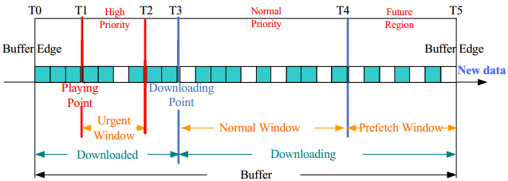
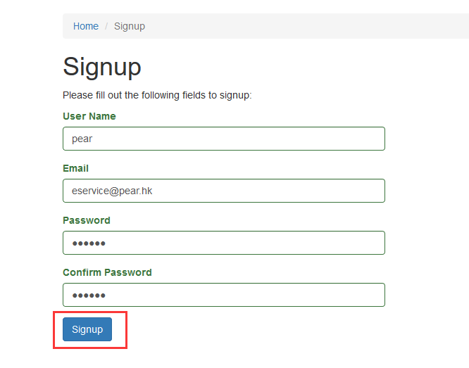
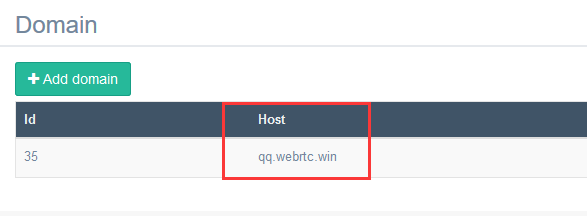
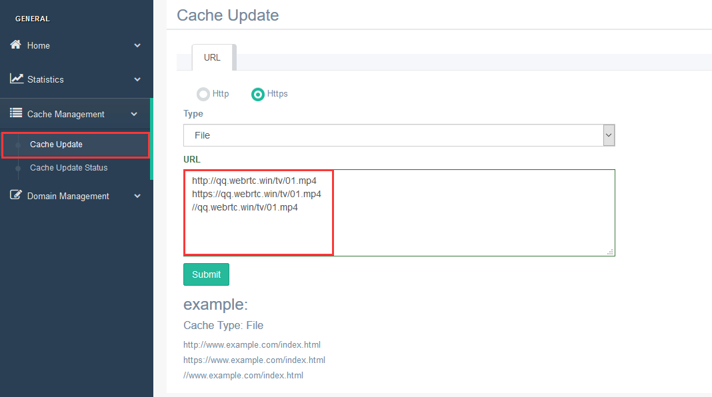

# For CPs

## Web端的一键接入

内容提供商可以“一键接入”Pear Fog CDN：

``` js
<video id="v1"></video>
<script src="PearPlayer.js"></script>
<script>
    var PearPlayer = require('PearPlayer');
    PearPlayer('#v1',{
        type: 'mp4',
        src: 'https://xxx.webrtc.win/tv/f.mp4',
        token: token
    });
</script>
```

> FogVDN是Web友好的，使用开放的Web标准（不需要额外的任何插件，只需要HTML5和WebRTC）
> 非常容易集成到现有项目中，只需几行JS代码便可以集成

* 默认采用First-aid算法



## 移动端的播放器SDK或协议嵌入

Pear为Android和iOS的开发者提供方便的协议或SDK嵌入方式... 

## OSS

### 用户注册(https://oss.webrtc.win/site/signup)


### 首先查看域名管理，如果该页面不存在域名，可点击添加域名
#### 查看域名


#### 添加域名


#### 查看绑定的域名


## 内容分发流程（指定缓存哪些视频文件）

### CP厂商通过后台推送新的视频文件到绑定的域名下，可按example规则添加缓存文件，默认为https协议
#### 推送新视频文件


### 文件先从源站缓存在我们内部Cache服务器，然后分发到各个节点，完成以后推送状态显示为成功（可登录NMS系统查看已经缓存的文件）
#### 查看推送新视频文件状态


## 查看流量

### 登录OSS系统，通过单个域名查看某个时间段下的流量（域名和时间可选）
#### 域名和时间组合查询流量


### 通过API查询

### 登录，获取token(https://oss.webrtc.win/site/login)
```  shell
curl  -X POST https://api.webrtc.win:7401/v1/oss/cp/login \
      -H "Content-Type: application/json" \
      -d '{
              "user_name": "cp",
              "password":  "123456"
          }'

```

``` shell
    curl -v -X GET "https://api.webrtc.win:7401/v1/oss/cp/53/traffic?host=qq.webrtc.win&start_date=149306600&end_date=1495890990" \
         -H "X-Pear-Token: ${token}" \
         -H "Content-Type: application/json"                           
```

响应
```json
[
  {
    "host": "host string",
    "values": [
      {
        "traffic": "流量 int",
        "time":    "时间戳 int"
      }
    ]
  }
]
```

### 上报视频调度维度API
- 运营商
- 国家、区域、省份
- 热度

```
GET https://api.webrtc.win:7401/v1/vdn/owner/{user_id:[0-9]+}  HTTP/1.1

http header: X-Pear-Token = token
```
请求
```json
[
    {
        "video": {
            "scheme": "string",
            "host":   "string",
            "uri":    "string"
        },
        "regions": [
            {
                "country":    "国家 string",
                "region":     "区域 string",
                "province":   "省份 string",
                "city":       "市   string",
                "isp":        "ISP  string",
                "popularity": "热度 int",
            }
        ],
    }
]
```
响应
```json
{
    "err_msg": "string"
}
```
