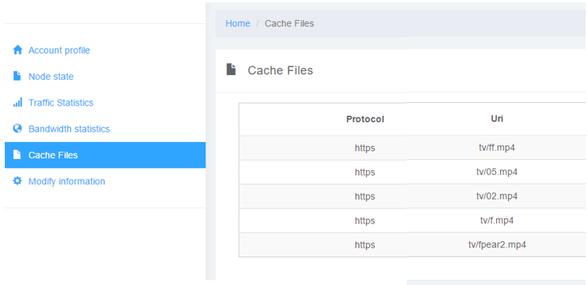

## Pear程序说明
### 特殊说明
- Pear程序需要具备root权限，Pear程序统一放在/usr/sbin目录中

### 死活程序(pear_restart)
- 负责监控其他Pear程序的健康运行
- 通过读取/etc/pear_restart/.conf.json配置文件，决定加载哪些服务（运行其他Pear程序）

### 终端监控程序(pear_monitor)
- 获取宿主系统平台架构信息，公网ip，本地ip，mac地址，hardware相关信息
- 配置HTTP服务器，包括动态申请HTTP和HTTPS端口
- 五秒定时检查外接设备（U盘或者移动硬盘）是否移除
- 五分钟定时获取流量、上报缓存文件信息和执行服务器的任务（下载缓存文件等）
- 三十分钟定时执行测速和远程升级的功能

### 数据通道程序(pear_webrtc) 
- 提供WebRTC DataChannel(UDP)数据传输通道 

### pear_httpd（暂时使用内置nginx程序，运营期加入）
- 提供HTTP/HTTPS(TCP)数据传输通道 

### 其他Pear程序（运营期逐步加入）
- 后续会直接通过远程升级的方式增加，以保证服务的稳定和持续增值的能力

### 缓存空间配置说明
- 需要10G以上的缓存空间，否则Pear程序无法工作
- 缓存空间 = 硬盘可用空间 + 硬盘已用缓存空间（pear缓存文件占用的空间）
- 比如，你插入一个可用空间只有1G的硬盘，但是里面有超过9G的空间被Pear缓存文件占用，那么也满足条件

### 检验Mac和SN有效性的API交互时序图


### 暂时提供一个统一的账号，所有节点的流量全部统计到这个统一的账号，查询流量API如下(账号: newifi2 密码: 123456)
#### 登录，获取token
```  shell
curl  -X POST https://api.webrtc.win:7201/v1/vdn/owner/login \
      -H "Content-Type:application/json" \
      -d '{
              "user_name": "newifi2",
              "password":  "123456"
          }'

```
#### 获取一定时间段内的流量（包括多个Mac）
``` shell
curl -v -X GET "https://api.webrtc.win:7201/v1/vdn/owner/51/traffic?start_date=1494780990&end_date=1495890990" \
    -H "X-Pear-Token: ${token}" \
    -H "Content-Type:application/json" 
```
``` js
[
      {
            "mac_addr": "20:76:93:3c:dd:51",
            "values": [
            {
              "traffic": 48,
              "time": 1494834900
            }]
      }
      {
          "mac_addr": "20:76:93:58:90:12",
          "values": [
            {
              "traffic": 16449536,
              "time": 1495440300
            }]
      }
]
```

  
#### 完整的Shell脚本如下（可以直接运行）
``` shell
#/bin/sh
# Pear Limited
r=`curl -X POST https://api.webrtc.win:7201/v1/vdn/owner/login \
         -H "Content-Type:application/json" \
         -d '{
                 "user_name": "newifi2",
                 "password":  "123456"
            }'`
user_id=`echo $r | cut -d ":" -f2 | cut -d "," -f1`
user_id="${user_id// /}"
echo $user_id;
token=`echo $r | cut -d "\"" -f14 `
#echo ${token}
curl -v -X GET "https://api.webrtc.win:7201/v1/vdn/owner/${user_id}/traffic?start_date=1494780990&end_date=1496443900" \ 
      -H "X-Pear-Token: ${token}" \
      -H "Content-Type:application/json" 
```

## 设备绑定流程和设备信息查询
### 用户注册（https://nms.webrtc.win/site/signup）


### 手动绑定设备（https://nms.webrtc.win/node-info/index）


### 微信绑定设备（运营期制作二维码贴在设备上）


### 查看设备关键信息


### 查看设备其他信息（CPU、Memory、IP，及服务健康状态，目前节点走HTTPS和dataChannel(DTLS)通道以保证数据传输的安全）


## 内容分发流程（指定缓存哪些视频文件）

### CP厂商通过后台推送新的视频文件


### 文件先从源站缓存在我们内部Cache服务器，然后分发到各个节点，之后可以看到节点缓存的文件信息

      
### 由于内容是基于热度分发的，所以要增加访问热度，来增加分发次数

- CP厂商提供访问热度
- 通过脚本提高访问热度

```
#/bin/sh
# Pear Limited

files=('/tv/pear.mp4')
r=`curl -X POST https://api.webrtc.win:6601/v1/customer/login \
        -H "Content-Type:application/json" \
        -d '{
                "user": "admin",
                "password":  "123456"
             }'`
token=`echo $r | cut -d "\"" -f4 `
echo $token
for file in ${files[@]}  
do  
    curl -v -X GET "https://api.webrtc.win:6601/v1/customer/nodes
    client_ip=127.0.0.1&host=qq.webrtc.win&uri=${file}&md5=ab340d4befcf324a0a1466c166c10d1d" \
         -H "X-Pear-Token: ${token}" \
         -H "Content-Type:application/json" 
done  
exit 0
```
     
### 查看流量
#### 通过NMS系统登录查询


#### 通过API查询

``` shell
    curl -v -X GET "https://api.webrtc.win:7201/v1/vdn/owner/51/traffic?start_date=1494780990&end_date=1495890990" \
         -H "X-Pear-Token: ${token}" \
         -H "Content-Type:application/json" 
```

## 手动安装Pear程序（运营期集成到设备上）
- 获取pear_software.tar.gz安装包
- tar -C / -zxvf pear_software.tar.gz解压到硬件载体中
- 配置开机启动pear_restart即可
- pear_restart自动读取/etc/pear_restart/.conf.json配置信息，启动Pear Fog程序集


