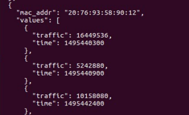
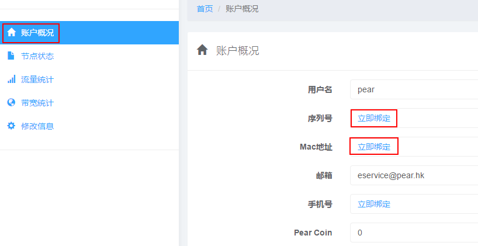
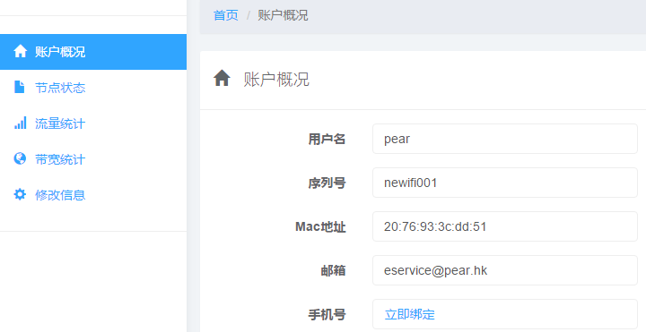

# 一. Pear程序说明
## 0. 特殊说明
*  Pear程序需要具备root权限，Pear程序统一放在/usr/sbin目录中
## 1. pear_restart死活程序
*  负责监控其他Pear程序的健康运行
*  通过读取/etc/pear_restart/.conf.json配置文件，决定加载哪些服务（运行其他Pear程序）

## 2. pear_monitor终端监控程序
*  获取PLATFORM平台架构信息，公网ip，本地ip，mac地址，hardware相关信息
*  配置nginx，包括动态申请http端口，和https端口
*  五秒定时检查外接设备（U盘或者移动硬盘）是否移除
*  五分钟定时获取流量、上报缓存文件信息和执行服务器的任务（下载缓存文件等）
*  三十分钟定时执行测速和远程升级的功能

## 3. pear_datachannel数据通道程序
*  提供webrtc datachannel(udp)数据传输通道 

## 4. pear_nginx（暂时使用内置nginx程序，后期加入）
*  提供http/https(tcp)数据传输通道 

## 5. 其他Pear程序（后期加入）
*  后续会直接通过远程升级的方式增加，以保证服务的稳定和持续增值的能力


## 6. 缓存空间配置说明
*  需要10G以上的缓存空间，否则Pear程序无法工作
*  缓存空间 = 硬盘可用空间 + 硬盘已用缓存空间（pear缓存文件占用的空间）
*  比如，你插入一个可用空间只有1G的硬盘，但是里面有超过9G的空间被Pear缓存文件占用，那么也满足条件
 
 
## 7. 检验Mac和sn有效性的API交互时序图
   
   
   
# 二. Pear提供API说明 (目前硬件载体平台的Mac都统计到name: newifi2 password: 123456帐号)
 1. 登录，获取token
 ```  shell
 curl  -X POST https://api.webrtc.win:7201/v1/vdn/owner/login \
       -H "Content-Type:application/json" \
       -d '{
              "user_name": "newifi2",
              "password":  "123456"
           }'

 ```
 2. 获取一定时间段内的流量（包括多个Mac）
 ``` shell
 curl -v -X GET "https://api.webrtc.win:7201/v1/vdn/owner/51/traffic?start_date=1494780990&end_date=1495890990" \
      -H "X-Pear-Token: ${token}" \
      -H "Content-Type:application/json" 
 ```
 
  
  
 3. 完整的shell脚本如下（可以直接运行）
 ``` shell
#/bin/sh
# Pear Limited
r=`curl  -X POST https://api.webrtc.win:7201/v1/vdn/owner/login \
         -H "Content-Type:application/json" \
         -d '{
                "user_name": "newifi2",
                "password":  "123456"
             }'`
user_id=`echo $r | cut -d ":" -f2 | cut -d "," -f1`
user_id="${user_id// /}"
echo $user_id;
token=`echo $r | cut -d "\"" -f14 `
#echo ${token}
curl -v -X GET "https://api.webrtc.win:7201/v1/vdn/owner/${user_id}/traffic?start_date=1494780990&end_date=1496443900" \ 
     -H "X-Pear-Token: ${token}" \
     -H "Content-Type:application/json" 
 ```
 
 
 # 三. 设备绑定流程
 ## 1. 用户注册(https://nms.webrtc.win/site/signup)
   
    
    
##  2. 手动绑定设备(https://nms.webrtc.win/node-info/index)
   
    
   
   
##  3. 微信绑定设备(后期制作二维码贴在设备上)
     
     
     
    
##  4. 查看绑定设备的关键信息
    
     
     
     
##  5. 查看设备CPU、Memory、IP、及服务健康状态，目前节点走https和datachannel(DTLS) 通道以保证数据传输的安全
    
     
     
     
 #  四. 内容分发流程
 
##  1. CP厂商通过后台推送新的视频文件
   
      
      
##  2.  文件先从源站缓存在我们内部cache服务器，然后分发到各个节点，之后可以看到节点缓存的文件信息
   
      
      
##  3.  由于内容是基于热度分发的，所以要增加访问热度，来增加分发次数
   
      3.1   CP厂商提供访问热度
      
      3.2   通过脚本提高访问热度

```
#/bin/sh
# Pear Limited

files=('/tv/pear.mp4')
r=`curl  -X POST https://api.webrtc.win:6601/v1/customer/login \
         -H "Content-Type:application/json" \
         -d '{
                "user": "admin",
                "password":  "123456"
             }'`
token=`echo $r | cut -d "\"" -f4 `
echo $token
for file in ${files[@]}  
do  
    curl -v -X GET "https://api.webrtc.win:6601/v1/customer/nodes
    client_ip=127.0.0.1&host=qq.webrtc.win&uri=${file}&md5=ab340d4befcf324a0a1466c166c10d1d" \
         -H "X-Pear-Token: ${token}" \
         -H "Content-Type:application/json" 
done  
exit 0
```
     
##  4.  查看流量
   
    4.1 通过NMS系统登录查询
       
    
    
    4.2 通过API查询
    
``` shell
    curl -v -X GET "https://api.webrtc.win:7201/v1/vdn/owner/51/traffic?start_date=1494780990&end_date=1495890990" \
         -H "X-Pear-Token: ${token}" \
         -H "Content-Type:application/json" 
```
   
     
# 五.手动安装pear程序
## 1. 获取pear_software.tar.gz安装包
## 2. tar -C / -zxvf pear_software.tar.gz解压到硬件载体中
## 3. 配置开机启动pear_restart即可
## 4. pear_restart自动读取/etc/pear_restart/.conf.json配置信息，启动pear程序集


