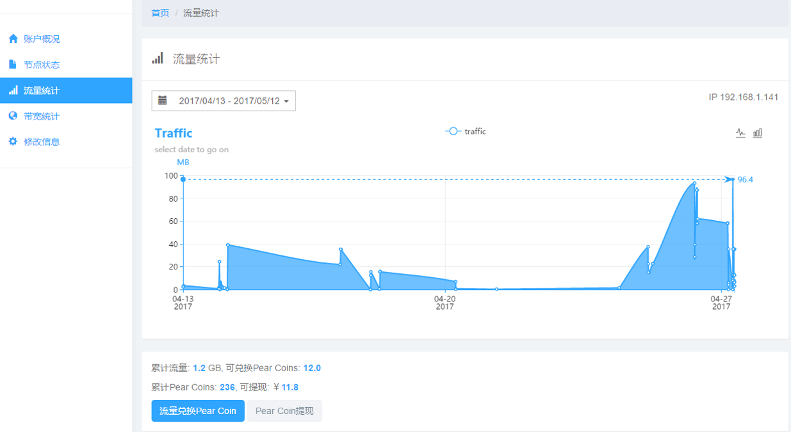

# 相关程序及策略说明
1. pear_restart死活程序
> 负责监控pear_software中所有程序的健康运行

2. pear_monitor终端监控程序
>  获取PLATFORM平台架构信息，公网ip，本地ip，mac地址，hardware相关信息
>  配置nginx，包括动态申请http端口，和https端口
>  五分钟定时执行测速和远程升级的功能

3. pear_nginx
>  提供http/https(tcp)数据传输通道 

4. pear_datachannel
>  提供webrtc datachannel(udp)数据传输通道 


# 关于存储空间的说明

 pear_monitor定时检测设备外接硬盘设备，永远选择容量最大的设备分区，目前配置为需要10G以上的缓存空间：
 > 缓存空间=硬盘可用空间+硬盘下已经缓存的空间
 
 
# 需Newifi集成事宜及API
   1. Newifi把下面文件集成到路由器中，设置开机启动pear_restart即可：
   * /usr/sbin/pear_monitor
   * /usr/sbin/pear_restart(会负责启动相关服务)
   * /usr/sbin/pear_nginx
   * /etc/pear_restart/.conf.json
   > 现有服务或新添加的服务，后续会直接通过远程升级的方式fix bug 或者增加新的服务，以保证服务的稳定和持续增值的能力
   
   2. 提供服务器端查询接口，查询mac与sn的有效性接口，API交互时序图如下：
   
   
   
 # Pear提供API说明
 1. 登录，获取token
 ```  shell
 curl  -X POST https://api.webrtc.win:7201/v1/vdn/owner/login \
  -H "Content-Type:application/json" \
  -d '{
    "user_name": "newifi2",
    "password":  "123456"
   }'

 ```
 2. 获取一定时间段内的流量（包括多个Mac）
 ``` shell
 curl -v -X GET "https://api.webrtc.win:7201/v1/vdn/owner/51/traffic?start_date=1494780990&end_date=1495890990" \
  -H "X-Pear-Token: ${token}" \
  -H "Content-Type:application/json" 
 ```
 3. 完整的shell脚本如下（可以直接运行）
 ``` shell
 #/bin/sh
# Pear Limited
echo "Begin get traffic by Mac & token"

r=`curl  -X POST https://api.webrtc.win:7201/v1/vdn/owner/login \
  -H "Content-Type:application/json" \
  -d '{
    "user_name": "pear",
    "password":  "123456"
   }'`
echo "-----------------------------------------------------------" -n
token=`echo $r | cut -d "\"" -f14 `
curl -v -X GET "https://api.webrtc.win:7201/v1/vdn/owner/51/traffic?start_date=1494780990&end_date=1495890990" \
  -H "X-Pear-Token: ${token}" \
  -H "Content-Type:application/json" 
 ```
 
 
 # 节点绑定
   1. 用户注册(https://nms.webrtc.win/site/signup)
   
    
    
   2. https://nms.webrtc.win/node-info/index  注册完成或者登录后进入下面界面：分别输入序列号和Mac地址(尤其Mac地址不能输入错误，后面业务逻辑都会与此关联)

   
    
   
   
   3. 通过微信绑定
     
     
     
    
    4. 查看绑定设备的Mac、SN等
    
     
     
     
    5. 查看设备CPU、Memory、IP、及服务健康状态，目前节点走https和datachannel(DTLS) 通道以保证数据传输的安全
    
     
     
     
 #  内容分发流程
 
   1.  CP厂商通过后台推送新的视频文件
   
      
      
   2.  文件先从源站缓存在我们内部cache服务器，然后分发到各个节点，之后可以看到节点缓存的文件信息
   
      
      
   3.  查看流量
   
    3.1 通过NMS系统登录查询
       
    
    
    3.2 通过API查询
    
``` shell
    curl -v -X GET "https://api.webrtc.win:7201/v1/vdn/owner/51/traffic?start_date=1494780990&end_date=1495890990" \
     -H "X-Pear-Token: ${token}" \
     -H "Content-Type:application/json" 
```
   
     
     
     


